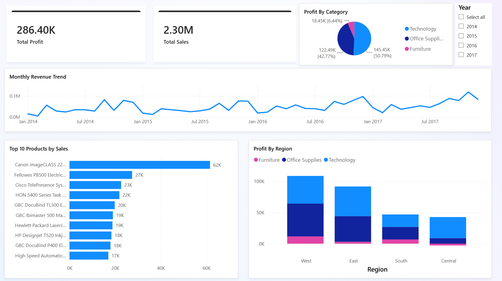

# Superstore Sales Analysis

Data analysis project using Python, SQL Server, and Power BI.

**Dataset:** [Superstore Sales Dataset — Kaggle](https://www.kaggle.com/datasets/vivek468/superstore-dataset-final)

---

## Project Pipeline

`Raw CSV → Python/pandas → SQL Server → Power BI`

---

## Dashboard Preview

---

## Python / pandas

- Standardized column names
- Split flat table into a star schema:
  - `fact_sales`
  - `dim_customer`
  - `dim_product`

**Column standardization:**

---

## SQL Server

- Loaded all 3 tables into `SuperstoreDB`
- Built star schema relationships

**Star Schema Model:**

---

## SQL Business Questions

### 1. Total revenue by region

### 2. Top 10 products by sales

### 3. Monthly revenue trend

### 4. Customers with more than 5 orders

### 5. Which category has the highest average order value

---

## Power BI

- Connected directly to SQL Server
- Built star schema relationships in Model View
- Created interactive dashboard with year slicer

[Download Dashboard PDF](Final/power%20bi/DashBoard.pdf)

---

## Notes

> The Power BI file connects to a local SQL Server instance (`SuperstoreDB`).
> To use it locally, import the CSV files from the `/data` folder into your own
> SQL Server instance, or connect Power BI directly to the CSV files.
